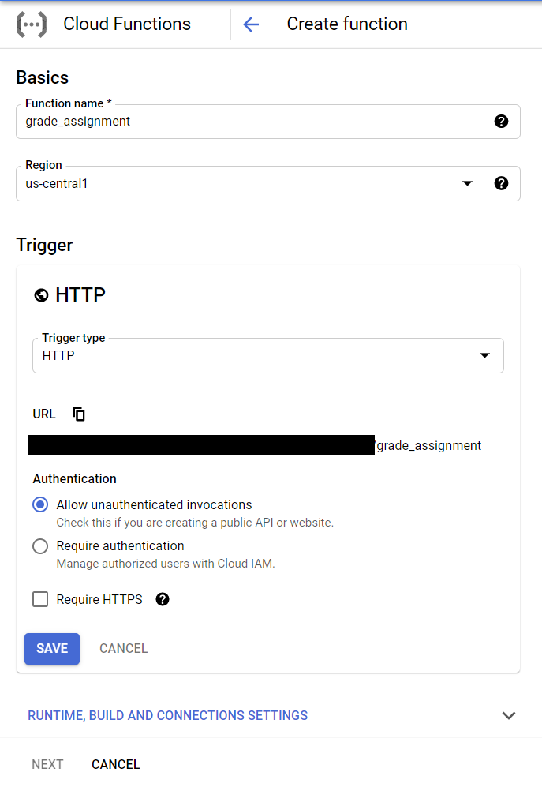
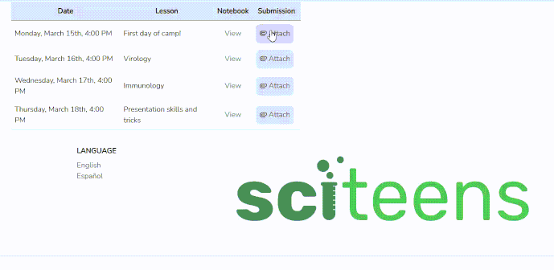

---

## Introduction
Pre-collegiate data science education sucks. While interviewing STEM educators across the United States, many expressed a common pitfall for undergraduate research students: a lack of rudimentary data science skills.  To address this difficulty, one of our primary goals at [SciTeens](https://sciteens.org), one of the ways in which we achieve this is by providing students with the opportunity to learn data science skills and how they apply to their own STEM fields of interest.  The professors we spoke to explained that many students don't realize they'll have to use computer science skills outside of computer science courses. In reality, the ability to process large amounts of data is becoming a necessity for virtually all STEM fields, from Meteorology to Exobiology.

To help students improve their data science skills, we at SciTeens decided to host Jupyter Bootcamps through our platform. [Jupyter Notebooks](https://jupyter.org/) are interactive computing interfaces that can be used to conduct data science tasks such as data exploration, cleaning, plotting, and testing. Jupyter supports a multitude of programming languages, including Python, Julia, and R (my personal favorites). Jupyter Notebooks are an invaluable tool for learning how to explore data, especially in Python, due to their support for inline plotting with packages such as Matplotlib. They also use markdown so you can keep notebooks interesting by including spicy TikToks and Memes.

## What Does the Autograder Accomplish? 
When we write notebooks, we tend to include practice problems at the bottom to allow students to check their understanding. To help students check their work, we added an autograder that extends the functionality of [Otter Grader](https://otter-grader.readthedocs.io/en/latest/index.html). With Otter, it's super simple to define questions within a notebook that require autograding. After running the command `otter assign`, an autograding zip file as well as a student-facing Jupyter Notebook, are generated.

With the autograder.zip file, we can autograde assignments manually on our own machine using the `grade_submission` method. All this method requires is the path to the autograder.zip file as well as the student's completed notebook (an .ipynb file).

Whereas we could have used Otter Graders built-in support for [Gradescope](https://www.gradescope.com/), we elected to keep the autograded submissions on our own servers for simplicity of connecting to our other resources. Thus, we created an autograding api via Google Cloud Functions that can grade student's submissions in real-time.

## Cloud Functions Implementation
To implement the autograding function, you must first have a Google Cloud account and have authorized the permission for creating Cloud Functions (there are some general getting started guides available [here](https://cloud.google.com/functions/).) Once approved, you can navigate to the Cloud Functions page within the Google Cloud Console (which can be found easily by searcing within the address bar), and then click "Create Function" (or click the link [here](https://console.cloud.google.com/functions/add)). From here, we can name our function, declare the region, declare the function trigger, and more. For now, we can name our function "grade_assignment", set the region to wherever is closest to the majority of your users, and set the trigger as HTTP. Below, we can further configure our function to only accept HTTPS requests. We'll leave our settings as to allow unauthenticated requests for now as well. We can also leave the runtime settings to the default memory allocation of 256 MiB, and the timeout of 60 seconds (the autograder typically takes around fourteen seconds to run with a cold start, and five seconds without.)



The next step is to code the function. We'd like the autograder to achieve the following:
1. Receive the autograder.zip file as well as the zipped student submission
2. Unzip the student's submission
3. Grade the student's submission

Simple enough! We can set our runtime to Python 3.9, and set the entry point to our Cloud Function as "grade". Next, we have to specify the required packages for our autograding function within the requirements.txt folder. The base requirement for our autograder is the otter-grader library. However, depending on your use case, you'll likely need to include Pandas, Matplotlib, and other data science-related packages. For now, we can put `otter-grader>=2.1.7` in our requirements.txt file. 

Next comes the Python code. The first thing that we'll do is to import the necessary files for autograding We'll use Python's standard libraries `zipfile`, `os`, and `shutil` to deal with zipping and unzipping files, moving files, and removing files (respectively.) We'll also import the `grade_submission` function from otter grader. 

```python
import zipfile
import os 
import shutil
from otter.api import grade_submission
```

Next, we'll go ahead and create our autograding function. We've already declared our Cloud Function entrypoint as the `grade` function, so now we can create said function. Furthermore, we want to allow Cross-Origin Resource Sharing since we will call this function from our front end. Thus, we have to add CORS headers to our response.

```python
def grade(request):
    # Set CORS headers for the preflight request
    if request.method == 'OPTIONS':
        # Allows GET requests from any origin with the Content-Type
        # header and caches preflight response for an 3600s
        headers = {
            'Access-Control-Allow-Origin': '*',
            'Access-Control-Allow-Methods': 'GET',
            'Access-Control-Allow-Headers': 'Content-Type',
            'Access-Control-Max-Age': '3600'
        }

        return ('', 204, headers)

    # Set CORS headers for the main request
    headers = {
        'Access-Control-Allow-Origin': '*'
    }
```

Now for the fun stuff. We'll check our request to ensure that the appropriate files (a student's zipped submission and an autograder.zip file) were supplied. Of course, everything that can go wrong will go wrong, so we'll handle some common issues with redundancy and Python error handling. We can first check that the files received by the API were, in fact, zip files. We can then ensure that we are able to successfully extract their child contents. When we do extract the files, we have to ensure to extract them to the `/tmp/` directory as that is the only directory that can be both written to and read from in Google Cloud Functions. In my experience, ZIP files can become easily corrupted when in transit between two servers. Thus, we can unzip and then rezip our autograder zip file to avoid such an issue. 

```python
autograder = request.files.get('autograder')
        submission = request.files.get('submission')

        if zipfile.is_zipfile(autograder) and zipfile.is_zipfile(submission):
            # Unpackage the files
            try:
                with zipfile.ZipFile(autograder) as z:
                    for f in z.namelist():
                        z.extract(f, "/tmp/autograder/")
            except:
                raise Exception("Could not extract autograder")

            try:
                with zipfile.ZipFile(submission) as z:
                    for f in z.namelist():
                        if f.endswith('.ipynb'):
                            z.extract(f, "/tmp/")
            except:
                raise Exception("Could not extract the submission")

            try:
                with zipfile.ZipFile("/tmp/autograder.zip", 'w', zipfile.ZIP_DEFLATED) as z:
                    for r, _, files in os.walk("/tmp/autograder/"):
                        dir = r.removeprefix("/tmp/autograder/")

                        for f in files:
                            z.write(os.path.join(r, f), dir + os.sep + f)
            except:
                raise Exception("Could not zip the autograder and its contents")
```

Next, we can go ahead and find our notebook file to be graded.
From there, we can grade this submission with respect to the autograder file. This will return an object that contains our grading results, including such information as the checks conducted on each question, the total number of points in the assignment, and the score that the student receives. From there, we can go ahead and clean up the `/tmp/` directory and then return a dictionary containing relevant information from the autograder (shoutout to Cloud Functions for autoconverting dictionaries to JSONs.)

```python
try:
                notebook = [f for f in os.listdir("/tmp/") if f.endswith('.ipynb')][0]
            except:
                raise FileNotFoundError("Could not find a notebook file to grade") 
                
            grades = grade_submission("/tmp/autograder.zip", "/tmp/" + notebook, quiet=True)

            # Clean up tmp 
            shutil.rmtree("/tmp/autograder")

            for file in os.listdir("/tmp/"):
                if os.path.isfile(file):
                    os.remove("/tmp/" + file)

            grader_json = {
                'total': grades.total,
                'possible': grades.possible,
                'score': grades.total / grades.possible,
                'questions': grades.to_dict()
            }
            
            return (grader_json, 200, headers)
```

All together now!

```python
import zipfile
import os 
import shutil
from otter.api import grade_submission

def grade(request):
    """Grades an incoming submission based on the supplied autograder ZIP file and 
    student ZIP submission.
    Args:
        request (flask.Request): HTTP request object. This request should contain the following:
        1. An "autograder.zip" to grade the corresponding ZIP file by
        2. A zipped submission file to be unzipped and graded.
    Returns:
        grader_json (json): An autograder json containing
        1. The total points awarded for the assignment
        2. The points possible for the assignment 
        3. The score on the assignment (simply total/possible)
        4. Grading information for each question
    """

    # Set CORS headers for the preflight request
    if request.method == 'OPTIONS':
        # Allows GET requests from any origin with the Content-Type
        # header and caches preflight response for an 3600s
        headers = {
            'Access-Control-Allow-Origin': '*',
            'Access-Control-Allow-Methods': 'GET',
            'Access-Control-Allow-Headers': 'Content-Type',
            'Access-Control-Max-Age': '3600'
        }

        return ('', 204, headers)

    # Set CORS headers for the main request
    headers = {
        'Access-Control-Allow-Origin': '*'
    }

    if request.files:
        autograder = request.files.get('autograder')
        submission = request.files.get('submission')

        if zipfile.is_zipfile(autograder) and zipfile.is_zipfile(submission):
            # Unpackage the files
            try:
                with zipfile.ZipFile(autograder) as z:
                    for f in z.namelist():
                        z.extract(f, "/tmp/autograder/")
            except:
                raise Exception("Could not extract autograder")

            try:
                with zipfile.ZipFile(submission) as z:
                    for f in z.namelist():
                        if f.endswith('.ipynb'):
                            z.extract(f, "/tmp/")
            except:
                raise Exception("Could not extract the submission")

            try:
                with zipfile.ZipFile("/tmp/autograder.zip", 'w', zipfile.ZIP_DEFLATED) as z:
                    for r, _, files in os.walk("/tmp/autograder/"):
                        dir = r.removeprefix("/tmp/autograder/")

                        for f in files:
                            z.write(os.path.join(r, f), dir + os.sep + f)
            except:
                raise Exception("Could not zip the autograder and its contents")

            try:
                notebook = [f for f in os.listdir("/tmp/") if f.endswith('.ipynb')][0]
            except:
                raise FileNotFoundError("Could not find a notebook file to grade") 
                
            grades = grade_submission("/tmp/autograder.zip", "/tmp/" + notebook, quiet=True)

            # Clean up tmp 
            shutil.rmtree("/tmp/autograder")

            for file in os.listdir("/tmp/"):
                if os.path.isfile(file):
                    os.remove("/tmp/" + file)

            grader_json = {
                'total': grades.total,
                'possible': grades.possible,
                'score': grades.total / grades.possible,
                'questions': grades.to_dict()
            }
            
            return (grader_json, 200, headers)

        else:
            raise Exception("Invalid file types submitted: must provide two zip files")

    else:
        raise Exception("You must provide files to be graded")

```
## Autograding from the Frontend

Now that the hard part is taken care of, all it takes is a simple request to the API to grade a file. All this requires is our API endpoint as well as the Javascript `fetch` function. The API endpoint can befound on the "Trigger" tab for our function's details on the Cloud Functions page. With this endpoint, we can send our form data (after storing the submission file and the autograder in the context) as a Cross Origin request via the code below. This code assumes that the variables `autograder` and `submission` store file blobs to be sent from the frontend (more on those [here](https://developer.mozilla.org/en-US/docs/Web/API/Blob)). We can then wait for the promise to be fulfilled, and log the contents of our request to the console. 

```javascript
let form_data = new FormData();
form_data.append("autograder", autograder);
form_data.append("submission", submisison);

fetch(
    "https://YOUR-PROJECT_INFO.cloudfunctions.net/gradeAssigment",
    {
        method: "post",
        mode: "cors",
        body: form_data,
    }
).then((res) => {
    console.log(res.json());
})
```

Depending on the UI of your application, you can end up with something that looks like this: 



## Closing Remarks
As you can see, it's pretty simple to implement a fully functional autograder with Google Cloud functions. If you have any suggestions for improvements or any questions in general, feel free to [reach out](mailto:john@sciteens.org?subject=Otter%20Autograder)!