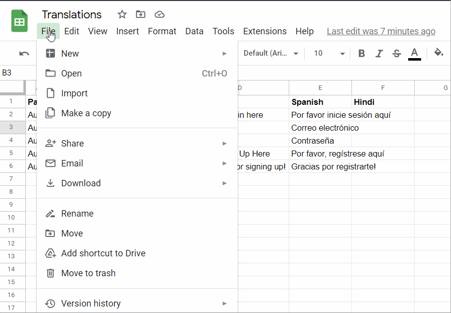

---

## Introduction 
Good websites need to be able to accomodate users across the globe. However, providing multi-language support for a website can be daunting to an indie developer or a small developer team with limited resources. Fortunately, with Google Sheets and only a couple of lines of Python, we can very simply get basic (though error-prone) translations to many languages in a format that is compatible with [i18n-next](https://www.i18next.com/).

## Google Sheets

Google Sheets is the G.O.A.T. when it comes to creating translations for an application. We'll use it to actually implement all of our basic translations using formulas. In particular, Sheets has a nifty formula called `GOOGLETRANSLATE` that allows us to effortlessly translate massive amounts of text into any language. Admittedly, the translations aren't always spot-on; there's only so much a language model BERT can do. However, it provides us with a good starting point to which friends fluent in other languages can validate our translations. 

We'll start by creating three columns labeled *Page*, *Component*, *Ref*, and *English*. The *Page* column represents what page we're translating. I use it more broadly to reference the main path that we are translating. *Component* allows us to specify, when applicable, what subpath we are translating. In my case, I have various routes under the path `/signin`, such as the base path (index), as well as a thank you page `/signin/thanks` or a forgot password page `/signin/forgot`. The *Component* row is more so organizational to make our spreadsheet more readable, whereas the *Page* row has utility for when we ultimately translate our application and want to take advantage of [deep keys](https://www.i18next.com/translation-function/essentials).

Next, we'll go ahead and fill out our *Ref* column. This column allows us to specify the block of text that we wish to have translated as a key to be stored in our JSON. In the past, I've opted for a naming convention that's extremely methodological, such as `paragraph1`, `heading_1`... etc... for each block of text to be translated. However, this quickly makes the development process a nightmare in that the code becomes rather unreadable. Instead, I now opt for a naming convention outlined in [this](https://phrase.com/blog/posts/ruby-lessons-learned-naming-and-managing-rails-i18n-keys/) blog post. It sacrifices a bit of semantics in favor of much more readable code for when we implement the translations on the front end. 

Finally, we'll include the actual text that we wish to translate in the *English* column. This assumes that the website was originally written in English; in case you're implementing your website in another language and wish to translate it, you can name this column to whatever language you are translating from. All told, your sheet should appear similarly to the GIF above.

Once we've established which pages and refs we wish to translate, we can actually implement the translations. This is as simple as using the `GOOGLETRANSLATE` function in sheets. This function takes in the text to translate, the source language, and the target language as parameters in that order. When specifying the languages, be sure to use the [ISO 639-1](https://en.wikipedia.org/wiki/List_of_ISO_639-1_codes) format. Unfortunately, country locale codes can't be specified in the `GOOGLETRANSLATE` function, which means that localization isn't achievable with Google Sheets for the time being. Here's to hoping that more robust language models emerge over the next few years! You can check out the GIF above to see how it works in action. From there, simply drag the cell down to apply the formula to all the remaining cells that need translations!

## Export and convert to JSON
Since we're working with [i18n-next](https://www.i18next.com/), we'll need to convert our translations into a JSON to implement them on the front end. Fortunately, this is very easy to achieve with Python. We'll import our spreadsheet as a CSV by first saving it from Google Sheets. I recommend saving this file as something to the tune of 'translations.csv'.



Next, we can create a new python file. We'll need Pandas installed on your system or within the environment from which you'll be executing this command. We can import the file as a Pandas DataFrame using the code below 

```py
import pandas as pd
translations = pd.read_csv("translations.csv")
```

Then, we'll specify a function called `slugify`. This will allow us to turn our pages into slugs so that we can access them from our code. This will essentially take any characters that are sensitive when used in URLs and replace them with underlines, while simultaneously lowercasing all alphabetic characters. This code is largely based on the code provided [here](https://www.peterbe.com/plog/fastest-python-function-to-slugify-a-string) for quickly slugifying strings. 

```py
def slugify(text: str):
    # https://www.peterbe.com/plog/fastest-python-function-to-slugify-a-string
    REMOVE_CHARS = ['"', '#', '$', '%', '&', '+', ',', '/', ':', 
                    ';', '=', '?', '@', '[', '\\', ']', '^', '`',
                    '{', '|', '}', '~', "'"]
    TRANSLATE_TABLE = {ord(char): u'_' for char in REMOVE_CHARS}

    text = text.translate(TRANSLATE_TABLE)
    text = u'_'.join(text.split())
    text = ''.join([c.lower() for c in text])
    return text
```

Next, we can go ahead and convert our translation into a JSON using the code below. In essence, this code will create a new table that only contains the information needed for creating a slug. This includes the page name, the ref, and the language that we're providing the translations in. We'll then go ahead and drop any empty columns (that we may have in our spreadsheet to break up the translations). Then, we can create a dictionary with each key corresponding to a page in our translations. Finally, we'll go ahead and assign every translation in our table to the respective page, and save this dictionary as a JSON.

```py
import json 

def save_translation(table: pd.DataFrame, language: str):
    
    # Use only the necessary columns, and turn page names into slugs
    table = table[['Page', 'Ref', language]]
    table['Page'] = table['Page'].apply(slugify)
    
    # Drop empty rows
    table = table.dropna()    
    
    # Create dictionary for every page's translations
    pages = {t: {} for t in table['Page'].unique()}
    
    # Save every row to dictionary
    for _, data in table.iterrows():
        try:
            pages[data['Page']][data['Ref']] = data[language]
        
        except:
            print("Couldn't append row: {}".format(data))
    
    # Save file
    with open("./{}.json".format(slugify(language)), 'w') as fp:
        json.dump(pages, fp)
```

We can then use our function to translate a block of code by passing in the language to translate to. Once this is done, we should have a file that appears as below. For example, if we translated to Spanish, 

```json 
{
  "auth": {
    "sign_in": "Por favor inicie sesi\\u00f3n aqu\\u00ed",
    "email": "Correo electr\\u00f3nico",
    "password": "Contrase\\u00f1a",
    "sign_up": "Por favor, reg\\u00edstrese aqu\\u00ed",
    "thanks_for_signing_up": "Gracias por registrarte!"
  }
}
```

Notice the special characters that are included in our translation. With this, you can use the i18n library to implement each translation into your code. I won't include a code sample for this because it differs from framework to framework, though [i18n-next](https://www.i18next.com/) works pretty universally across frameworks. 

---