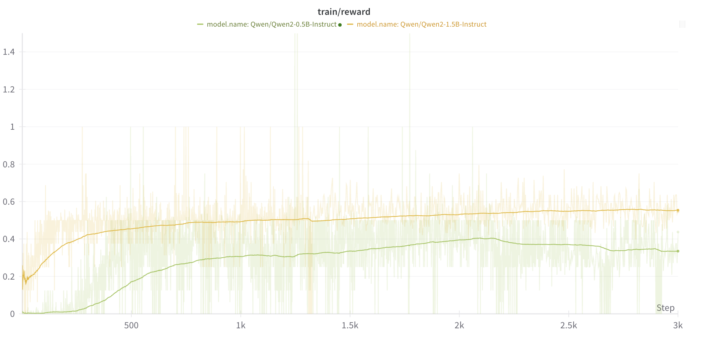

## Introduction
I've recently been experimenting with training RLHF models on popular datasets, and I've compiled some practical tips that have improved my results and experimentation times. Some of these notes will be glaringly obvious; others maybe not so much. Either way, they should save you time ansd frustration when working with RLHF. 

**NOTE** I plan on adding more plots from Weights and Biases soon to back up my claims, but for now, just take my word for it? 

## Model Selection
A lot of my recommendations here stem from using the Qwen family of models. I have not rigorously explored other model families, but I leave that for you to do (and you can call me out if and when these recommendations don't apply to other model families). [Recent work](https://arxiv.org/pdf/2503.01307) suggests that Qwen has nice intrinsic properties that allow it to reason well, making it optimal for GRPO tasks.

There are a few critical considerations when selecting a base model for RLHF. I first opt for a model with at least 1B parameters. I'm constrained to a 4090 card, and I prefer to do full model fine-tunes instead of LoRAs, so I stuck with the [Qwen 2.5 1.5B parameter model](https://huggingface.co/Qwen/Qwen2.5-1.5B-Instruct). I tried out the 0.5B parameter model as well, but it wastes a lot of time trying to get the proper output formatting (i.e. the think and answer tags) right.



 I also tried out the non-instruction tuned models and they were fairly abysmal. This makes total sense though: we provide a prompt for these models that specifically instructs them to use think and answer tags. 

## Saving Time and Memory
Much of the notes I have below generally apply to training large language models, but they're particularly relevant when working with Reinforcement Learning used in conjunction with LLMS, which is even more resource-intensive.

### Use AdamW8Bit if Possible
I'm a sucker for AdamW. It's got some very nice properties when it comes to regularization, with [Grokking](https://arxiv.org/pdf/2412.10898v1) as a byproduct! That being said, it's an absolute memory hog. Fortunately, the [bitsandbytes library](https://github.com/bitsandbytes-foundation/bitsandbytes) includes an 8-bit quantized version of the optimizer that dramatically reduces memory usage while maintaining most of the performance benefits. I won't discuss the benefits in depth, but there is a [nice discussion](https://huggingface.co/docs/bitsandbytes/main/en/explanations/optimizers) about the optimizers provided by the bitsandbytes library. 

### Use optimized serving for the target model
A core concept of many RL algorithms used with LLMs is calculating the per-token KL divergence with the baseline model that we are tuning on top of. This is to ensure that our output distribution does not stray too far away from the baseline model, which could potentially lead to some rather bizarre outputs from [reward hacking](https://en.wikipedia.org/wiki/Reward_hacking). Thus, we have to simultaneously use our baseline LLM along with our trained LLM to calculate the KL divergence.

LLM generation is slow, even if you load in the model using 4-bit or 8-bit compression, use Fast Attention 2, and run it in the torch [inference mode](https://pytorch.org/docs/stable/generated/torch.autograd.grad_mode.inference_mode.html) context window. Fortunately, frameworks like SG-Lang and vLLM provide optimized inference engines for text generation. These can speed up your code, with the drawback being that they lead to some rather wonky, non-DRY code (where you will have to de-tokenize and then re-tokenize text to get the tokenized outputs of the models). I avoid this in general because of how irrationaly triggered I get by code that isn't DRY or seems redundant, but hey, if that doesn't bother you, knock yourself out. 

### Use optimized numerical formats
Do I really even have to say this? Use bf16 and tf32 if you can. Otherwise, upgrade your card. We're not in the stone ages anymore, you can afford to upgrade your V100s at this point. 

### Use a warmup period to avoid huge gradient spikes early in training
This one applies to RL tasks across the board, either when being used with LLMs or in a more traditional (can we call the Atari Gym traditional now, it's been almost a decade since it was created) tasks. Hell, it applies to most training tasks in general. You'll probably get some fairly large gradient updates at the beginning of training, and instead of having to mess around with and tweak gradient clipping, just start with a lower learning rate! 

## Response Formatting
### Take Advantage of continue_final_message
This one sort of feels like cheating, but it works well to kick things off quicker when using GRPO. In your prompt, you can start the computer agent's message for it by specifying the [`continue_final_message=True`](https://huggingface.co/docs/transformers/main/en/chat_templating#continuefinalmessage) flag in the tokenizer. This way, you can start the model's response 
with a <think> token by default, so it doesn't have to struggle to figure out that it should start each response with one from the start. Just make sure that when you calculate your rewards, you prepend the think token onto it manually. For example, if we're passing in multiple prompts to the model, we can do 
```python
system_prompt = "Answer the user's question. Show your work in <think> </think> tags. and return the final equation and answer in <answer> </answer> tags"
questions = ["what is 2 + 2?", "what is 2 * 2?"]
input_texts = [
    tokenizer.apply_chat_template(
        [
            {"role": "system", "content": system_prompt},
            {"role": "user", "content": prompt},
            {
                "role": "assistant",
                "content": "Let's solve this step by step\n<think>",
            },
        ],
        tokenize=False,
        continue_final_message=True,
    )
    for prompt in prompts
]
```

### Use "Soft" Reward Functions
This one is really reward engineering 101. If you give too sparse of signal, it's gonna take a long time for your model to figure out how to give better outputs. If you give it partial rewards for giving OK responses, it will learn better. For example, I will give partial rewards for partially correct formatting in the outputs; if the response at least has a opening and closing think token, give it a partial reward! If the response includes at least an opening and closing answer token, give it even more reward! If it has the think tokens in the correct format and the answer tokens in the correct format, even more reward! 

Same applies to the answer. This really helps especially when you have longer outputs. Math datasets are typically constrained to very short outputs, which are typically either a number or an equation. Other datasets, especially chemistry and biology datasets, can have more complex answers requiring multiple words. In this case, I'll typically use a loss like BLEU or ROUGE (mostly BLEU, since it measures the precision of N-grams, and we want to optimize for that overlap in the answer) instead of an exact match. 

That being said, make sure not to be too lax; If you have too soft of a reward function, your model may just get comfy outputting shoddy outputs. 

### Accentuate the Positive
In my experience in RL, training is a lot more stable when you opt to give rewards >= 0. This is completely anecdotal, but this has always worked for me. 

## Extras (I didn't know how to categorize these hehe)
### Anneal the temperature over training
I'm not sure how crucial this is, but it seems to help at least a little bit when training. I try to linearly anneal the temperature from a very high value to a low value over the course of training to balance the exploration/exploitation tradeoff. 

### Group size doesn't matter too much
I've been able to get away with a group size of 2 for most of my training, and they seem to work just fine. That being said, I'm limited with compute, so that's all I can try for now (spare GPU cycles?)