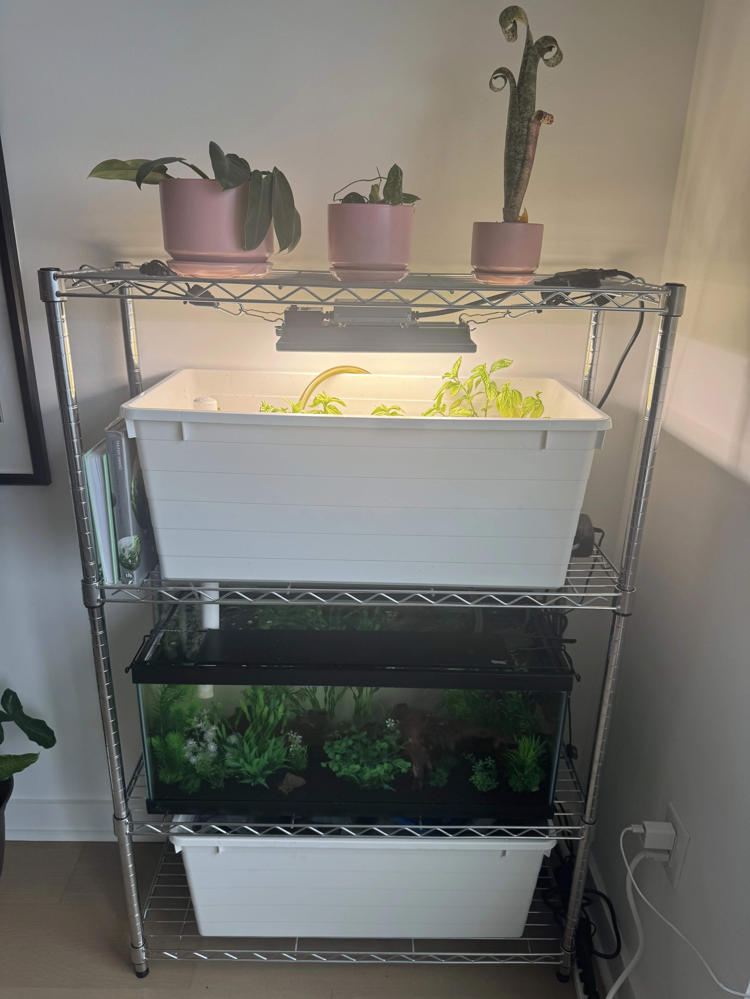
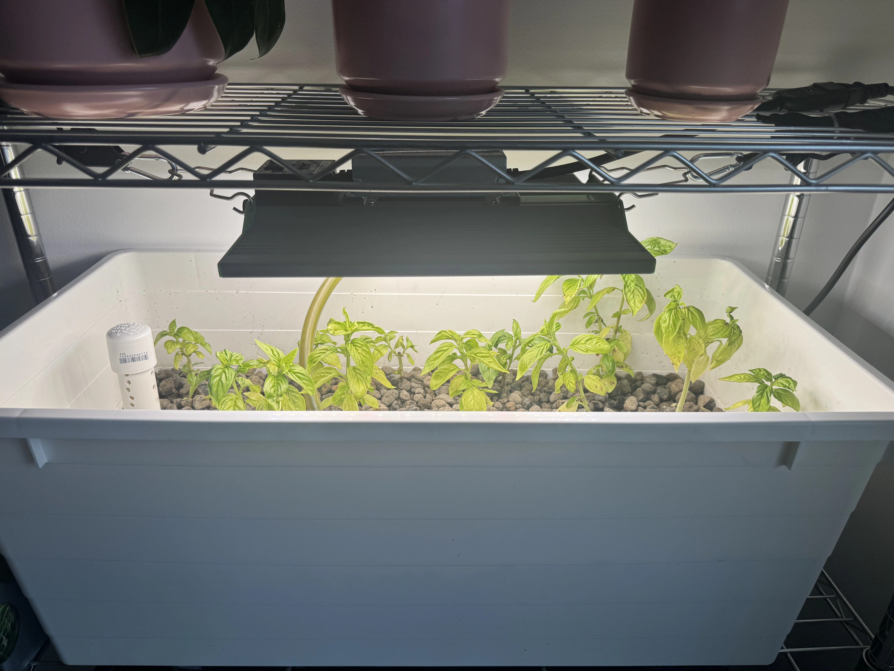
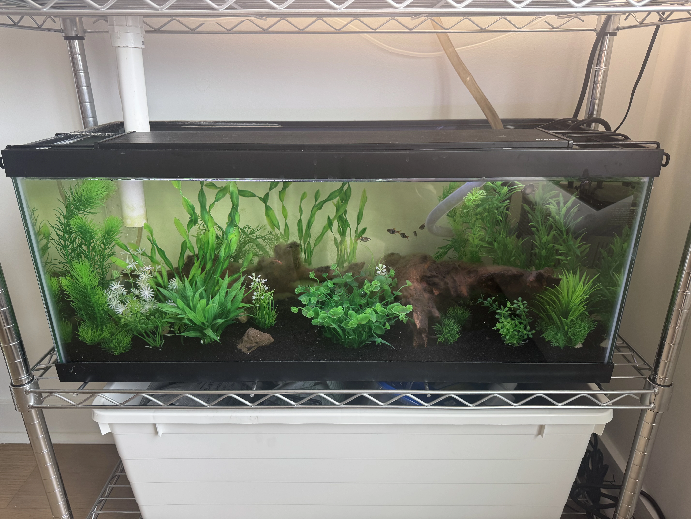

## About 
I'm currently working on an in-apartment aquaponics system, with my awesome girlfriend [Erin Murphy](https://erinmurphy.dev/). If you're curious about how to build this, check out [her blog post](https://erinmurphy.dev/projects/project-1) instead of my brief synopsis. 

At the moment, we're growing Basil. At the time of writing, our twenty gallon tank includes five Harlequin rasboras, two nerite snails, and four ghost shrimp. We plan on slowly increasing the bio load, primarily through more shrimp, as we continue the development of our tank.

The entire setup is rougly four feet tall.

At the moment, we're only growing basil but plan to grow other herbs in the future. We prefer to grow herbs that grow like weeds for their ease of maintenance (such as mint and basil).

In the tank, we have plastic plants as to not outcompete the herbs in the grow bed for nutrients. 